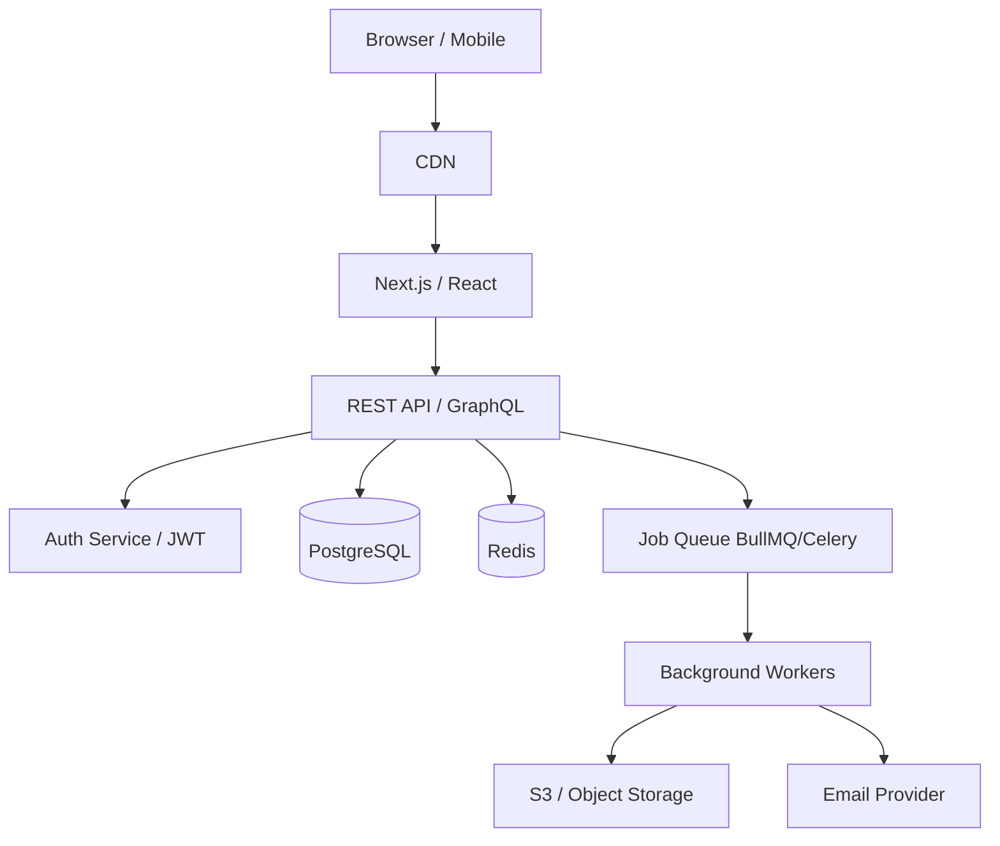

# Skill: Fullstack Architect

## Purpose
Design or review the architecture of any fullstack application — API design, data modeling, state management, service boundaries, and deployment topology — so the system is scalable, maintainable, and built on proven patterns.

## When to Use
- Starting a new feature that touches frontend, backend, and database
- The codebase has grown messy and needs structural clarity
- Deciding between architectural approaches (monolith vs microservice, REST vs GraphQL, SSR vs CSR)
- Reviewing a system design before committing to it

---

## Rules
- Recommend what the project actually needs now, not a hypothetical future scale.
- Default to the simplest architecture that solves the problem correctly.
- Separate concerns: routing, business logic, data access must be distinct layers.
- APIs must be versioned from day one.
- Every architectural decision must have a stated reason.
- Do not introduce a new tool/library unless it solves a real problem you've identified.

---

## Step-by-Step Workflow

### Step 1 — Understand the Domain
```
1. What is the core problem this app solves?
2. Who are the users and what are their primary actions?
3. What are the performance requirements (users, requests/sec, data volume)?
4. What are the integration requirements (third-party APIs, webhooks, jobs)?
```

### Step 2 — Data Model Design
```
1. Identify the core entities and their relationships.
2. Design the schema: normalize to 3NF unless you have a read-performance reason not to.
3. Identify which queries will be most frequent — index them.
4. Decide on soft delete vs hard delete for each entity.
5. Identify which fields need audit timestamps (createdAt, updatedAt, deletedAt).
```

### Step 3 — API Design
```
1. Choose REST (resources + HTTP verbs) or GraphQL (flexible queries).
   - Use REST for: simple CRUD, public APIs, file uploads.
   - Use GraphQL for: complex nested data, mobile clients with bandwidth constraints.
2. Define resource naming: noun plurals, no verbs (/users, not /getUsers).
3. Define error response contract: { error: { code, message, field? } }.
4. Plan pagination: cursor-based for large datasets, offset for admin tables.
5. Define auth: JWT bearer token on every protected route, refresh token flow.
```

### Step 4 — Frontend Architecture
```
1. Identify data-fetching strategy: SSR, CSR, ISR, or hybrid (Next.js).
   - SSR: SEO-critical pages, dashboards.
   - CSR: authenticated apps with rich interactivity.
   - ISR: marketing pages, blogs.
2. State management:
   - Server state: React Query / TanStack Query or SWR.
   - Client UI state: useState/useReducer (most cases), Zustand for cross-component.
   - Avoid Redux unless you have complex async state machines.
3. Component structure: pages → layouts → features → shared UI.
4. Define the API client layer: one file, all endpoints, typed responses.
```

### Step 5 — Service Boundaries
```
1. Start with a modular monolith: separate modules by domain, not services.
2. Extract a service only when: independent deployment, different scaling need, or team boundary.
3. For background jobs: use a job queue (BullMQ, Celery, Spring @Scheduled) — never block HTTP threads.
4. File storage: always use object storage (S3-compatible), never local disk.
5. Emails / notifications: always async via queue, never in the HTTP response path.
```

### Step 6 — Document the Architecture
```
1. Write a one-page ADR (Architecture Decision Record) for each key decision.
2. Create a simple system diagram (ASCII or Mermaid).
3. List the tech stack with the version and reason for each choice.
```

---

## Architecture Diagrams (Mermaid)



---

## Commands to Run

```bash
# Visualize database schema (Prisma)
npx prisma studio

# Check for circular dependencies
npx madge --circular src/

# Analyze bundle size (Next.js)
ANALYZE=true npm run build

# Check unused exports
npx ts-prune
```

---

## Validation Checklist
- [ ] Entities and relationships are clearly modeled
- [ ] API contract is defined (routes, request/response shapes, error format)
- [ ] Authentication and authorization boundaries are explicit
- [ ] Background jobs are decoupled from HTTP layer
- [ ] No business logic in routes/controllers (moved to service layer)
- [ ] Database indexes designed for primary query patterns
- [ ] Pagination on all list endpoints
- [ ] Environment-specific config is externalized (no hardcoding)
- [ ] Data validation at API boundary (not just frontend)

---

## Final Response Format

```
## Architecture Design

**System Type:** [Monolith / Modular Monolith / Microservices]
**Tech Stack:**
- Frontend: [framework + version]
- Backend: [framework + version]
- Database: [DB + ORM]
- Infra: [cloud + services]

**Core Entities:**
[entity diagram or list with relationships]

**API Design:**
[key routes with method, path, auth requirement]

**Key Architectural Decisions:**
1. [Decision] — [Reason]
2. [Decision] — [Reason]

**Open Questions / Trade-offs:**
- [what's uncertain and why]
```
